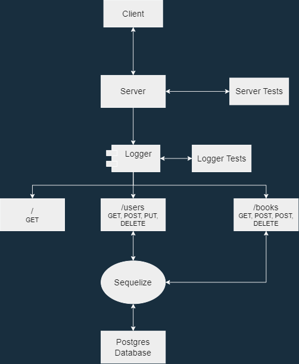

# Code 401 Lab - 04

## API Server

An API server built using NodeJS, Express, and PostgreSQL. Tests performed using Jest and SuperTest.

### Author: Robert Shepley

<!-- Replace URL's and add more necessary links -->
- [Tests Report](https://github.com/ShepleySound/api-server/actions)
- [Assignment Pull Request](https://github.com/ShepleySound/api-server/pull/2)
- [Heroku Prod Deployment](https://shepley-api-server.herokuapp.com/)

### Setup

#### Running the application locally

- Ensure PostgreSQL is setup on your machine, and that you have an existing user with createdb permissions.

- Clone the repository to your local machine, then run the following commands in your terminal -

  ```bash
    npm install
    npm run db:create
    touch .env
  ```

- Add the following lines to the newly created `.env` file.

  ```text
  PORT=<port number>
  DATABASE_URL = 'postgres://localhost:5432/app-api'
  ```

- In the `config/config.json` file, set your username and password under the 'development' entry. Keep in mind, these both must be wrapped in double quotes.

- Run the following command -

  ```bash
    npm start
  ```

- Congratulations! You should now be able to access the application in your browser by navigating to `http://localhost:PORT/`, with `PORT` being the port number that you specified in the .env.

#### Endpoints

The following endpoints interact with a Postgres database using Sequelize. Sequelize validates the entries on creation using the specified required properties.

- Endpoint: `/`
  - Response: `The server works!`

- Endpoint: `/api/v1/users`
  - Methods: GET, POST
  - Required properties for POST:
    - name (string)

- Endpoint: `/api/v1/users/id`
  - Methods: GET, PUT, DELETE

- Endpoint: `/api/v1/books`
  - Methods: GET, POST
  - Required properties for POST:
    - title (string)
    - author (string)
    - pages (integer)

- Endpoint: `/api/v1/books/id`
  - Methods: GET, PUT, DELETE


### Tests

- Unit Tests: `npm run test`
- Lint Tests: `npm run lint`

### To-Do

- Increase test coverage.
- Add endpoint options for querying books by min/max page size.
- Add endpoint options for querying people by age.
- Add more properties to the data models.

### UML

(Created with [diagrams.net](https://app.diagrams.net/))


